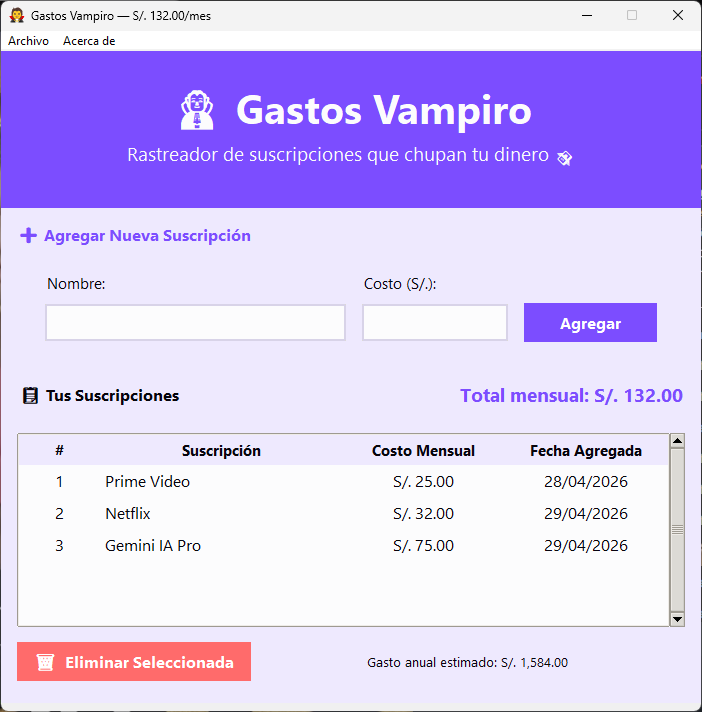

# Curso de Tkinter - Gastos Vampiro 🧛‍♂️

Bienvenido al repositorio del curso de Tkinter. Aquí aprenderás a construir aplicaciones de escritorio modernas y funcionales utilizando Python.

## 📚 Documentación del Curso

Explora los conceptos fundamentales y la configuración del entorno para comenzar con el pie derecho:

- [🚀 Introducción a Tkinter](docs/01-intro-tkinter.md) - Conceptos básicos y primeros pasos.
- [📦 Entornos Virtuales](docs/02-crear-venv.md) - Cómo configurar tu ambiente de desarrollo de forma aislada.

## 💻 Proyecto: Gastos Vampiro

Nuestra aplicación principal donde aplicamos todo lo aprendido. Un gestor de suscripciones y gastos con una estética oscura y premium.

- [📂 Código Fuente del Proyecto](/gastos-vampiro)

## 📦 Descargas (Producción)

¿Quieres probar la aplicación sin configurar el entorno de desarrollo? Descarga la versión lista para usar:

- [📥 Descargar Gastos Vampiro (.zip)](blob:https://github.com/5b7805e9-45bc-4a4b-8954-7dbc3fb58b19)

## 📺 Curso en YouTube

Sigue las lecciones paso a paso en video:

- [🎥 Lista de Reproducción del Curso](https://www.youtube.com/@AlexRoel) *(Enlace pendiente de actualizar)*
<!-- Aquí puedes añadir más enlaces específicos a videos conforme se publiquen -->

## 📋 Contenido del Curso

### 🛠️ MÓDULO 1: INTRODUCCIÓN A TKINTER
- ⏩ Instalar Tkinter
- ⏩ Crear tu primera ventana
- ⏩ Elementos de Tkinter
- ⏩ Agregar funcionalidad a Boton
- ⏩ Variables de Control
- ⏩ Eventos
- ⏩ Theme Tkinter -> TTK
- ⏩ Organizando Elementos 

### 🏗️ MÓDULO 2: ESTRUCTURA DEL PROYECTO
- ⏩ Estructurar proyecto
- ⏩ Barra de menú
- ⏩ Ventana de dialogo
- ⏩ Crear header y agregar estilos
- ⏩ Crear sección de formulario
- ⏩ Manejo de archivos -> JSON
- ⏩ Guardar registros
- ⏩ Crear sección de Resumen
- ⏩ Crear tabla de registros
- ⏩ Mostrar registro en la Tabla
- ⏩ Crear Footer

### 🚀 MÓDULO 3: ENTORNO VIRTUAL Y CREAR EJECUTABLE
- ⏩ Crear entorno virtual
- ⏩ Exportar a PDF
- ⏩ Completando estilos
- ⏩ Agregar icono personalizado
- ⏩ Crear ejecutable

---
Desarrollado con ❤️ por [Alex Roel](https://github.com/alexroel)